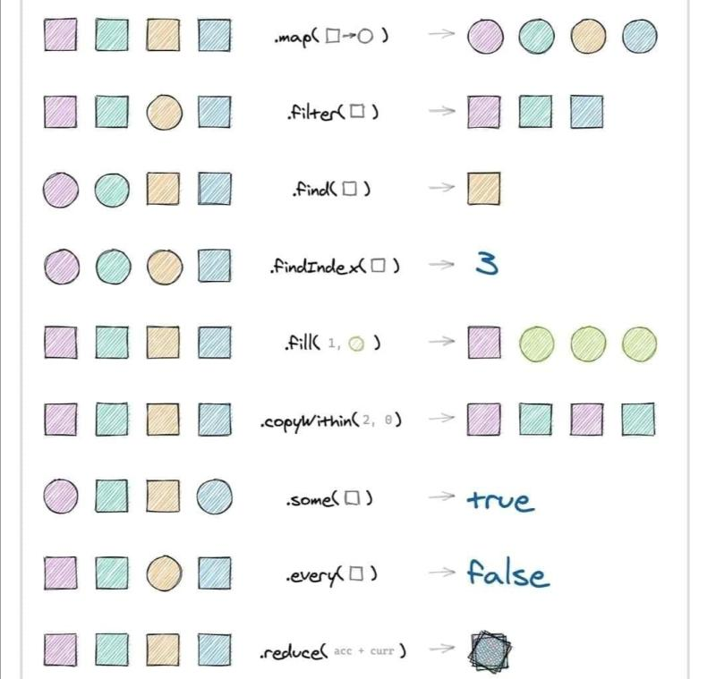

# JS vanilla

La bible c'est la [MDN](https://developer.mozilla.org/fr/)

---

## Les variable

```js
const boolean = true;

const string = "true";

let number = 10;
number = "string";
```

---

## Les fonction

```js
async function faiDesTruc(string) {
  const attend = await truc;
  return attend;
}

// ou

const faiDesTruc = async (string) => {
  const attend = await truc;
  return attend;
};

// Appelle de fonction
faiDesTruc(string);
```

---

## Les array

<details>
  <summary>Boucle cheat sheet</summary>

</details>

```js
const array = [1, 2, 3, 4, 5, 6];

// Boucle for
for (const nbr of array) {
  console.log(nbr);
}

// Boucle forEach
const oneByOne = array.forEach((nbr) => {
  console.log(nbr);
});

// Bouble find
const returnOneItem = array.find((nbr) => (nbr = 4)); // 4

// Boucle map
const updateAllItemsInArray = array.map((nbr, index, array) => nbr / 3); // [3, 6, 9, ...]

// Boucle filter
const returnNewArray = array.filter((nbr) => nbr <= 2); // [1, 2]

// Boucle reduce
const reduce = array.reduce(
  (
    previous, // Valeur précédente
    current, // Valeur actuel
    index, // Index de la valeur actuel
    array // Array en initial
  ) => {
    if (index === 1) {
      current = 555;
    }
    if (index === 3) {
      current = previous[index - 1] * current;
    }
    return [...previous, current];
  },
  [] // Valeur par default et aussi a l'index 0
); // [ 1, 555, 3, 12, 5, 6 ]

array.sort(); // range le tableau par ordre alphabétique ou numerique

// Transforme une string en array puis remplace des element pour les retransformer en string
const p = "La superbe phrase.";
p.replace(" ", ", "); // La, superbe, phrase.
```

---

## Les object

```js
const bigObject = {
  success: true,

  array: [
    { id: 1, name: "toto" },
    { id: 2, name: "tata" },
    { id: 3, name: "tutu" },
  ],

  object: {
    id: 1,
    name: "toto",
  },

  function: () => {
    return 1;
  },
};

// Les objet
const obj = {
  key: "value",
  fonction: (params) => {
    return params;
  },
};
console.log(obj.fonction(string));
```

---
